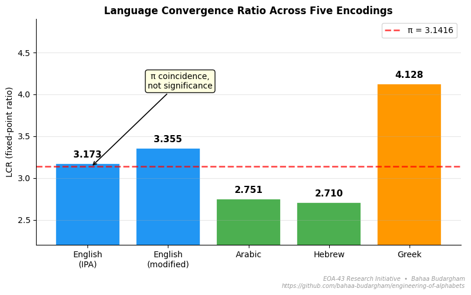

# EOA-43: A Rank-Collapsed Deterministic Word Representation with a Convergent Recursive Basis

> A deterministic, training-free word representation with a strange reproducible property: the ratio of consecutive terms in its 43-term basis sequences stabilizes to ≈ 3.17 — for **every** letter name, for **every** word, and across **random symbols** the system was never built for. The number is **not a universal constant**. Across 5 encodings in 4 languages it shifts from **2.710 (Hebrew)** to **4.128 (Greek)** — a 1.5× spread. The empirical mapping is in the paper. The theoretical explanation is **open**.


*The English IPA bar coincidentally sits near π; this proximity is not a structural property.*

---

**[▶ Try the Interactive Playground](https://bahaa-budargham.github.io/engineering-of-alphabets/playground.html)**
Type any word. See its 43-dimensional vector. Add character noise. Inspect the 16 basis elements.

**Papers:** [EOA-43 (paper 1)](#citation) · [EOA-Recurrence (paper 2, cross-encoding)](#citation) · **Benchmark notebook:** [Colab](https://colab.research.google.com/drive/1WvLdr4qqDU_KY8H26DaYnR3N1U6CQIdV?usp=sharing)

---

## What is in this repository

| File | Description |
|---|---|
| `english_alphabet.json` | Public 43-term basis vectors for the 26 English letters. 16 unique sequences (3 groups + 13 unique letters). |
| `playground.html` | Standalone interactive demo. No server, no build, no dependencies. Open in any browser. |
| `figures/lcr_across_encodings.png` | The cross-encoding LCR plot (paper 2, Section 3). |
| `LEADERBOARD.md` | Tracks submissions for the open theoretical questions (see below). |

The internal deterministic operator that generates the basis sequences is **not** in this repository. Only its public outputs are released. See [Disclosure status](#disclosure-status) below.

---

## Open theoretical questions

The companion paper (EOA-Recurrence) formalizes three open questions derived from the public sequences. The questions (stability within a fixed encoding, cross-encoding mapping, and inverse design) are described in detail in EOA-Recurrence, Section 6. A bank of seven candidate hypotheses (H1–H7) is provided in Section 5.

The 43-term sequences are public and fully measurable by anyone. The operator that generated them is the only gated piece. For access under research-protective terms, please refer to the Research Disclosure Program in EOA-43, Section 2 (contact details provided there). Submissions of theoretical explanations are tracked in [`LEADERBOARD.md`](./LEADERBOARD.md).

---

## Disclosure status

**Public (this repository and the linked Colab notebook):**

- The 43-term basis sequences for the 26 English letters
- The black-box EOA-43 vector generator (for English alphabet characters)
- The benchmark code, baselines, and evaluation pipeline
- The precomputed noisy-word vectors for the OCR experiment (required because the generator for out-of-alphabet characters is not disclosed)
- The empirical LCR measurements for 5 encodings across 4 languages (paper 2, Section 3)
- The cross-encoding consistency experiment (paper 2, Section 4)
- The hypothesis bank H1–H7 (paper 2, Section 5)

**Not public:**

- The internal deterministic operator that produces the basis sequences
- The closed-form mapping from encoding properties to LCR (open question)

A preliminary least-squares test of the natural linear hypothesis (v<sub>n+1</sub> = M · v<sub>n</sub>) yielded large reconstruction errors on the public data; the status of this hypothesis and the need for normalized-error analysis are discussed in EOA-Recurrence, Section 2. The operator is made available to qualified research collaborators under research-protective terms. Contact the author for the agreement. The mathematical properties attributed to the operator in either paper should be read as **empirical observations of its outputs** unless and until a full formal specification is published.

---

## The 16-element basis

The 26 English letters collapse to **16 unique sequences**. Three groups of letters share sequences:

| Group | Letters | Color in playground |
|---|---|---|
| 1 | B, D, P, T, V, Z | red |
| 2 | F, L, M, N, S | blue |
| 3 | I, R | green |
| Unique (×13) | A, C, E, G, H, J, K, O, Q, U, W, X, Y | grey |

This is the source of the 2.69 KB on-demand memory footprint: 16 × 43 × 4 bytes = 2,752 bytes, independent of vocabulary size. Because all 16 basis vectors are perfectly collinear (see EOA-43, Section 5.3), the basis can in principle be compressed to a single 43-term direction plus 16 scalar amplitudes (~236 bytes); the approximation error of this compressed form is not yet evaluated.

---

## File format

`english_alphabet.json` contains the deterministic basis vectors. Each key is one letter; each value is a 43-dimensional floating-point sequence.

```json
{
  "a": [<43 floats>],
  "b": [<43 floats>],
  "...": "...",
  "z": [<43 floats>]
}
